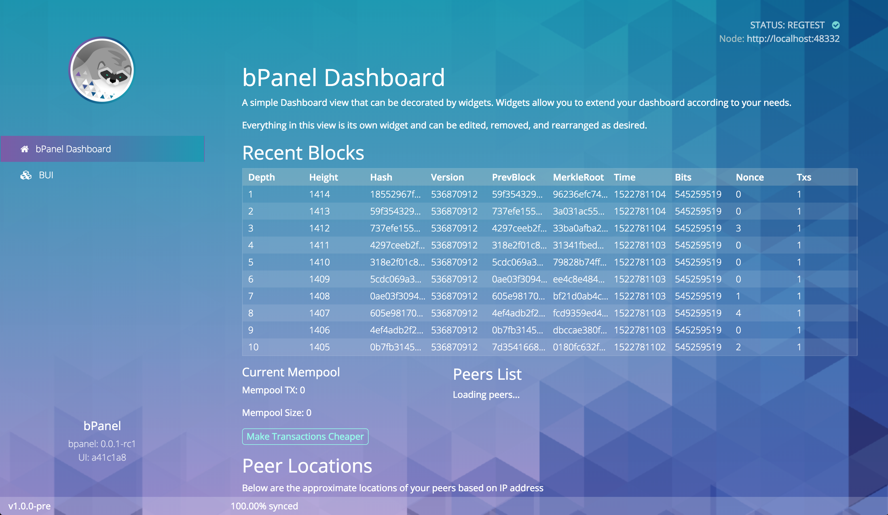

# Genesis Theme
The first in a chain of reference themes for bPanel.

Block time (avg): 1 year

This is a simple plugin that bundles together a collection of existing
bPanel plugins to create a useful interface to help you get started
with the platform. bPanel will come pre-installed with this theme but
can be easily replaced by editing the `pluginsConfig.js` file.

### Included Plugins:
- "@bpanel/bmenace-theme": "0.0.1"
- "@bpanel/bpanel-footer": "0.0.1"
- "@bpanel/bpanel-header": "0.0.2"
- "@bpanel/bui": "0.0.1"
- "@bpanel/chain-sockets": "0.0.1"
- "@bpanel/dashboard": "0.0.1"
- "@bpanel/mempool-widget": "0.0.1"
- "@bpanel/peers-widget": "0.0.1"
- "@bpanel/recent-blocks": "0.0.3"

